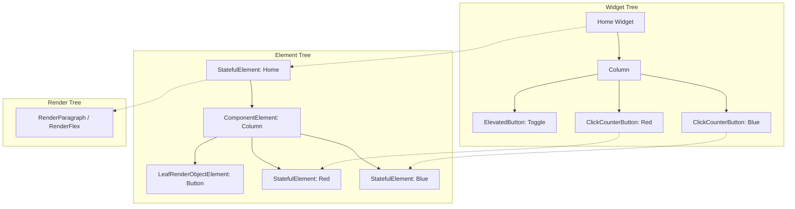

# Flutter Interview Guide: Widget Lifecycle, State Disposal, and the Three Trees

This repository is designed to demonstrate one of the most common and critical concepts tested in Flutter engineering interviews: **the relationship between Widgets, Elements, and State objects, and how they behave during conditional rendering and rebuilds.**

---

## 📱 The Demo Scenario

In [lib/main.dart](file:///c:/Shakirullah25/flutter/projects/flutter_interview_q/lib/main.dart), we have a simple application:
1. A **Home** page containing a **Toggle Button** (`Hide Btn` / `Show Btn`).
2. Two **ClickCounterButton** widgets (Red and Blue), which track their own click count.

### The Interactive Flow:
* You click the **Red button** once (Count: **1**).
* You click the **Blue button** twice (Count: **2**).
* You press **Hide Btn**. The counters disappear.
* The debug console prints:
  ```text
  Colors.red button disposed
  Colors.blue button disposed
  ```
* You press **Show Btn**. The counters reappear, but their counts are back to **0**.

---

## 🧠 Core Interview Concepts Explained

### 1. Widget Removal vs. Invisibility
When you click **Hide Btn**, the parent state toggles `showBtn = false` and calls `setState()`. 

```dart
if (showBtn)
  const ClickCounterButton(color: Colors.red),
if (showBtn)
  const ClickCounterButton(color: Colors.blue),
```

> [!IMPORTANT]
> **The widgets are not just hidden or set to invisible.** 
> Because of the conditional `if (showBtn)`, when `build()` runs again, the two `ClickCounterButton` widgets are **completely omitted** from the newly returned widget tree. They no longer exist in the widget tree configuration.

### 2. State Destruction & The Reset Trap
Because the widgets are removed from the tree, Flutter unmounts their corresponding elements. This triggers the destruction of their associated `State` objects:
* The `dispose()` lifecycle method of `_ClickCounterButtonState` is called.
* The state objects containing the variables `count = 1` and `count = 2` are **permanently destroyed** and garbage collected.
* When you toggle `showBtn = true` again, Flutter is forced to create **brand new** `Element` and `State` objects. Therefore, the counters reset to **0**.

---

## 🔄 Rebuild vs. Dispose: Key Distinctions

It is vital to understand the difference between a widget **rebuilding** and a widget being **disposed**.

| Action | What Happens to the Widget | What Happens to the `State` Object | State Variables (e.g., `count`) |
| :--- | :--- | :--- | :--- |
| **Clicking Counter Button** (`setState` inside counter) | Rebuilt (new Widget configuration created) | **Survives** | Preserved (e.g., increments from 1 to 2) |
| **Toggling Hide Button** (`setState` in parent Home) | **Removed** from tree | **Destroyed** (`dispose()` called) | **Lost forever** |

---

## ⚡ The `const` Misconception
Notice that the buttons are declared as `const`:
```dart
const ClickCounterButton(color: Colors.red)
```

> [!WARNING]
> **The Myth:** *"Because the widget is `const`, its state is cached and will be preserved."*
>
> **The Reality:** This is false. The `const` keyword only affects **Widget compilation and creation** (allowing Dart to reuse the exact same Widget instance in memory during rebuilds to avoid recreating the configuration class). It has **no impact** on the lifecycle of `Element` and `State` objects. Once an Element is removed from the active tree, the State is disposed, `const` or not.

---

## 🌳 Under the Hood: The Three Trees
Flutter coordinates rendering using three parallel trees:



### What Happens During Diffing?
1. **When `showBtn` is `true`**: The element tree contains `StatefulElement`s for both the Red and Blue buttons, holding their active `_ClickCounterButtonState` (with their respective `count` values).
2. **When `showBtn` becomes `false`**: Flutter compares the old widget tree to the new widget tree.
   * It sees that `ClickCounterButton` is no longer in the widget tree at those positions.
   * Flutter deactivates the corresponding `StatefulElement`s.
   * Since they aren't reparented or reused in the same frame, they are **unmounted**, and their `State.dispose()` is executed.

---

## 🏆 The Ideal Interview Answer

If an interviewer asks you to explain what happens to the state of the counter buttons in this code, here is the comprehensive answer they are looking for:

> "When the Red button is clicked once and the Blue button twice, their internal state variables (`count`) become 1 and 2, respectively. 
> 
> When the toggle button is clicked to hide them, `showBtn` is set to `false` and `setState()` is called on the parent `Home` widget. This triggers a rebuild of `Home`. Because of the conditional rendering (`if (showBtn)`), the two counter widgets are no longer returned in the new build method, meaning they are completely removed from the Widget Tree.
> 
> Flutter's reconciliation algorithm detects this removal, deactivates and unmounts their corresponding Elements, and destroys their associated `State` objects, triggering the `dispose()` method. 
> 
> If the buttons are shown again, they are instantiated as brand new widgets with brand new Elements and State objects, resetting their counters back to 0. The `const` keyword does not prevent this, as it only optimizes widget instantiation memory, not State object lifecycles."

---

## 🚀 How to Run the Project
To run this demo project locally, ensure you have Flutter installed and set up on your machine:

1. Clone or open the project directory.
2. Run standard pub get:
   ```bash
   flutter pub get
   ```
3. Run the application on your connected device/simulator:
   ```bash
   flutter run
   ```
4. Observe the console logs during interaction to see `dispose()` logs in real-time.
